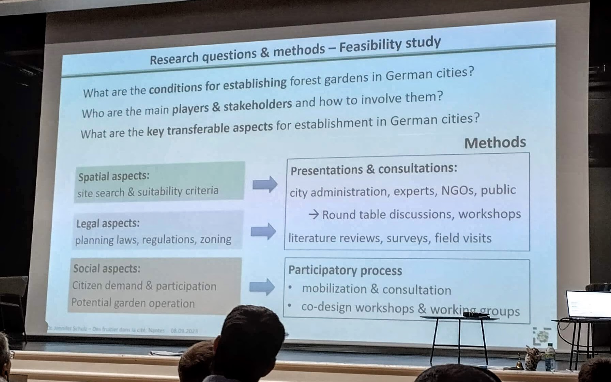
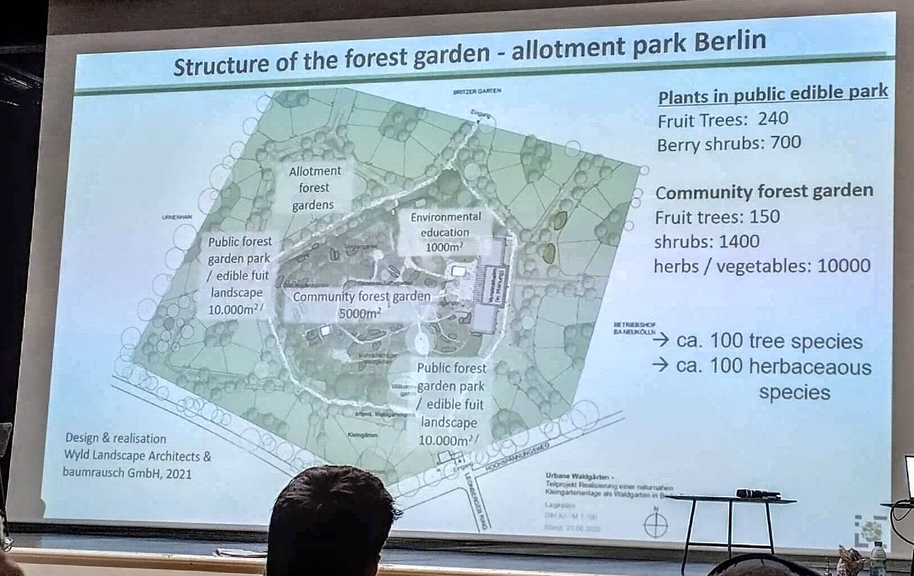
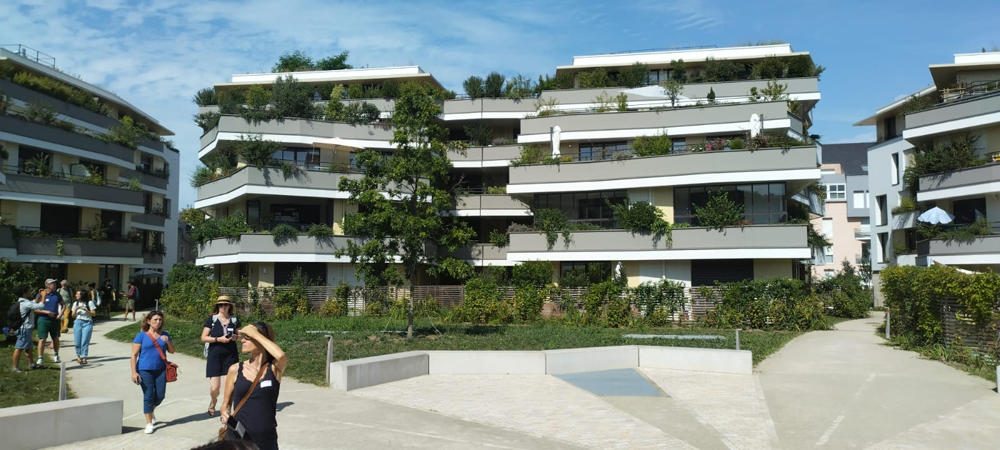
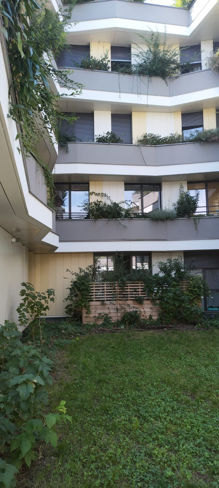
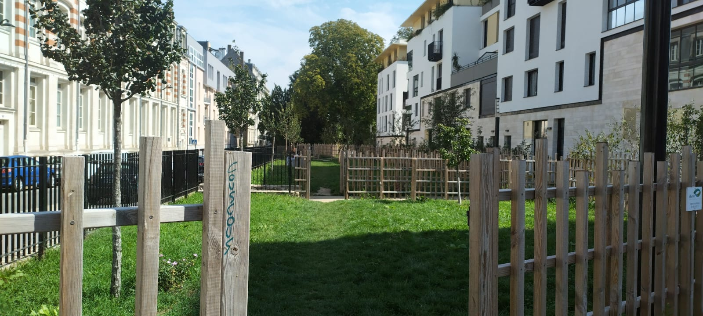
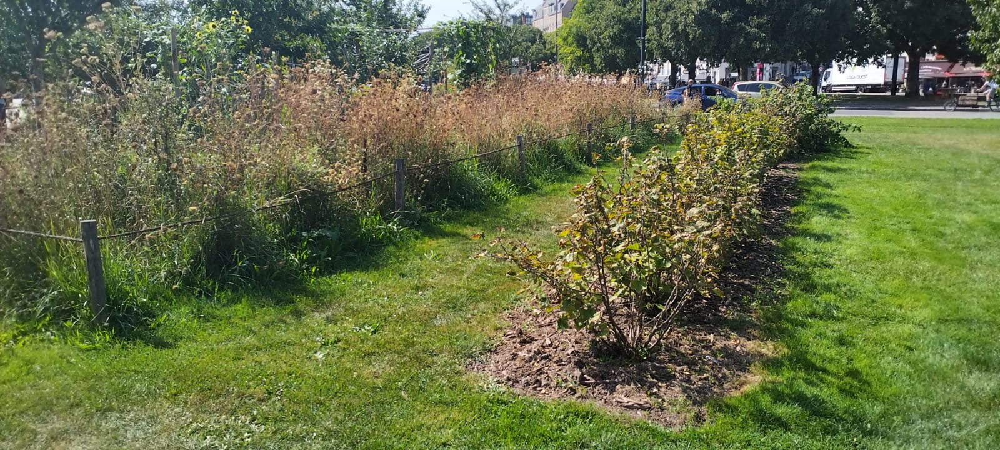

# Assise des fruitiers dans la ville - Nantes - 7,8 septembre 2023

Panel 1 - Regards croisés de professionnels sur la réintroduction des arbres fruitiers dans la cité

## Panel 1 - Regards croisés de professionnels sur la réintroduction des arbres fruitiers dans la cité

### Michel Audouy ([Valhor](https://www.valhor.fr/))
Valhor : Interprofession des métiers de l'horticulture et du paysage

18e s : retour du fruitier ("j'aurais pour parc un verger", JJ Rousseau), puis désamour.

Depuis une trentaine d'années, hausse de la demande. Quelques créations de vergers à la fin des années 80 (dont même certains sur des aires d'autoroute). Aujourd'hui : haltes fruitières et gourmandes à Nantes.
Nécessite mobilisation de savoirs faire anciens et nouveaux

### Marie Fiers ([AFAUP](https://www.afaup.org/))
AFAUP : asso française d'agriculture urbaine professionnelle, depuis 2016.

Objectif : aider les villes à devenir + durable, fertile, apaisée. Nécessité de s'adapter aux contraintes de la ville.

L'asso veut :
- fédérer les acteurs
- fournir des outils accessibles à tous
- valoriser l'agriculture urbaine, amateurs (potagers et jardins partagés ) et professionnels (ferme inter et péri urbaine).

Jusqu'à présent, la partie fruitière était peu développée, mais on constate la pénurie de production locale de fruit, donc sans doute amené à se développer.

### Gil Melin (Mairie de Ris-Orangis)
Ris Orangis : 850ha, 30 000 habitants, ville engagée dans programme de ville nourricière

Melin met en avant l'arbre en tant que medium : ce qui est intéressant, c'est la friction, la confrontation qui apparaît au moment de son implantation, sa plantation, son entretien...

Implantation : Comment ceux chargées de l'entretien peuvent devenir des médiateurs avec population, élus, écoles... Car ils vont acquérir des savoirs faire, en rencontrant des spécialistes, des agronomes.

### Alexandra Bonnet ([ENSP](https://www.ecole-paysage.fr/fr))
Un jardin productif, fruitier, est plus fragile qu'un jardin d'agrément.
Arbres fruitiers ont leur place dans les parcs, peut-être moins dans les rues ?
Enjeu de formation. Favoriser les formes en palissage de murs plutôt que sur la voie publique ?
Aller vers des formes qui respectent la physiologie de l'arbre (palissage type 17e, 18e siècle)

### Laurent Chatelain (pépinières Chatelain)
Porte greffe est essentielle pour longévité de l'arbre adapté à un peu tout. C'est la clé de la réussite de l'implantation d'un arbre : la bonne santé de ses racines.

### Régis Triollet (DGER)
DGER : Direction Générale de l'Enseignement et de la Recherche, Ministère de l'Agriculture

Animateur autour des questions d'éducation.
200 000 élèves, 800 écoles de formation. 26 000 élèves concernés par les fruitiers (du CAP au BTS).
Enjeux actuels de la formation :
- adaptation aux changements climatiques,
- boulot sur la biodiversité.

C'est aussi un objet support pour la formation socle, on peut apprendre avec un fruitier tout ce qu'on a à apprendre sur les arbres. Ça repositionne ce qu'est le vivant. La plupart des personnes compétentes sur la tailles sont en fin de carrière, enjeu de transmission.

### Raphaël Hervouët (CFP-MFR La Ferrière )
Vente de formation pour adulte, souvent en reconversion, et notamment dans les métiers du paysage.
Formation sur la taille des fruitiers
Formation pour agents des collectivités dans l'implantation de paysages comestibles.

### Romaric Perrocheau (directeur de Nature et Jardins, ville Nantes)
"Chaque pomme est une fleur qui a connu l'amour", Felix Leclerc

S'appuyer sur les plantes qui nourrissent pour faire du lien social.
Cf les [stations gourmandes](https://www.levoyageanantes.fr/lieux/stations-gourmandes/) dans tous les quartiers, avec arbres fruitiers et tables de pique nique (à l'origine un essai artistique).
Puis création de paysages nourricière gérés par les jardiniers de la ville. Environ 15 tonnes de légumes produits par an.
Ensuite, on a voulu montrer que les animaux avaient toujours vécus avec les plantes : [transhunantes](https://metropole.nantes.fr/transhunantes). Un troupeau de moutons va de parc en parc, ne se nourrit que de ce qu'il y a dans le parc (pas d'apport de foin extérieur), puis transhumance (qui fait événement) dans la ville pour changer de parc.

Projet aussi de mettre des vergers dans la cité.

Cf [nature.metropole.nantes.fr](https://nature.metropole.nantes.fr/)

### Questions du public

**Est-ce une évidence de planter des fruitiers en ville ? Y'a-t-il des freins ?**

L'arbre fruitier est séduisant mais on n'imagine pas tout ce qu'il y a derrière, toutes les contraintes. La commande est souvent naïve : "je veux des fruitiers".
Des fruitiers en villes, ça peut être la conservation de vergers existants, la transformation de l'espèce public... Diversité de formes, faut beaucoup de métiers.
Il faut aussi s'adapter au suivi qui peut être fait, aux capacités d'entretien.

**Quand on met des fruitiers dans une ville, qui s'en occupe, quelle est la recette ?**

Comment on forme les agents communaux ? Ce qui m'a intéressé, c'est l'éclat dans les yeux de certains agents quand on leur présentait le projet. Les agents ont déjà du apprendre beaucoup de choses. On doit détecter chez les agents ceux qui ont envie de progresser.
Les habitants de Ris Orangis : 40 nationalités différentes, les envies de fruitiers sont pas les mêmes suivant l'histoire ou les cultures.
Les fruitiers palissés sont mieux entretenus s'ils sont plantés à côté du bureau du maire, plutôt qu'au fond d'un parc en périphérie. À chaque espace son type de fruitiers, + ou - exigeants.

**Appropriation des espèces comestibles par les habitants ?**

Exemple de Dijon, qui installe des vergers hors des parcs. Les habitants sont impliqués dans la plantation. Une fois les arbres en place, il y a un panneau explicatif qui dit que quand il y aura des fruits tout le monde peut les cueillir.

**D'expérience, dans ces vergers on rencontre 2 types de public :**
- familles CSP+ qui font de la pédagogie, explique à leurs enfants la nature,
- familles CSP- qui viennent compléter leur panier alimentaire.

A Nantes, certains squares résistent mieux que d'autres.

Souvent, les gens cueillent les fruits trop tôt, trop tard... Besoin de pédagogie ?

Mais après tout, est-ce grave si des gens qui manquent de moyen cueillent les fruits pas mûrs ?
Sur la signalétique, il faudrait peut-être rajouter la période de récolte.

**Possibilité d'implanter hors vergers ? Fruitiers pour communes avec moins de moyens ? Expérimentations de nouveaux types de fruitiers avec changement climatique ?**

Voir Beauvais autour cathédrale
Retour d'expérience lors d'une fête des plantes, avec de l'ornemental et du fruitier : 100% de demande de fruitiers.

**Quid des jardins forêts ? Lien entre taille traditionnelle et nouvelles formes ? Pollution des sols ?**

Il faut aussi former les élus pour que l'argent public soit pas gaspillé dans des formes aberrantes. (NdT: pas compris si les formes aberrantes dont la la personne qui répondait parlait était précisément les jardins forêts)

Pour un jardin forêt, il faut plus de compétences, faire appel à un paysagiste pour le design. Surtout, pour tout projet, il faut vérifier que l'objet répond aux usages des habitants. C'est ça qui fonde la légitimité d'un projet.

Problème d'attractivité des métiers du jardin, on a des gros déficits, difficultés de recrutement. Il faut raconter des histoires, parler aux jeunes pour qu'ils aient aussi envie de se former.

Panel 2 - Quelques-uns des multiples visages des arbres (et arbustes) fruitiers dans la cité

## Panel 2 - Quelques-uns des multiples visages des arbres (et arbustes) fruitiers dans la cité

### Thierry Regnier (spécialiste de l’arboriculture fruitière, école du breuil, vergers urbains, murs à peche),

Vergers dans écoles : outil pédagogique important)

### François Moulin (spécialiste de l’arboriculture fruitière, potager du roi, croqueur de pommes),

Nous a montré des poiriers de façade de fou. A l'origine sur des maisons rurales, fermes, transformés depuis en habitation

*Poiriers en façade*

### Jacques Beccaletto (spécialiste de l’arboriculture fruitière, potager du roi, encyclopédie de je ne sais quoi ),

Il a montré des formes fruitieres (je cite) :
- faciles à tailler,
- facile à installer,
- à mise à fruit rapide,
- durée de vie courte (env 20 ans),
- durée de formation acceptable

Dans les formes modernes :
- solaxes, conduite basée sur l'arcure
- cordon vertical
- u simple
- trident
- palissage à la diable. A la base, c'était fait sans sécateur : pincement, etc. C'est adapté à beaucoup d'espèces, pas uniquement pommier / poirier
- cordon
- vigne taille guyot

Touffe haute : noix, noisetier, figuier sureau, par renouvellement de rejet depuis le sol

Buissons (fruits rouges), gobelets, buissons plats palissés (framboisiers)

### Jennifer Schulz (Jardins-forêts urbaines/ Urbane Waldgärten Potsdam, Allemagne)

jardin-forêt : Focus sur la cueillette
Au moins trois niveaux : arbres, buissons, herbacées

Urbane waldgärten, Berlin : https://www.urbane-waldgaerten.de/

### Christine Chasseguet et Pauline Frileux ([Les Arbusticulteurs](https://www.arbusticulteurs.com/)),

Différents enjeux écologiques et sociaux sont liés.
La mise en place d'espace fruitiers est souvent la collaboration entre une mairie et d'autres acteurs.

Pour diversifier les formes : installer des mâts pour des plantes grimpantes
Partir sur des espèces moins connues : aronia, cornouiller mâle, fuschia, mahonia, feijoa...

Tenter les fruitiers méditerranéen ? Kumquats, bigaradiers ? Pour ça, choisir des portes greffes résistants au gel.

On peut aussi étendre la notion de nourricier :
- nourricier pour la faune
- nourricier pour le sol
Cf eleagnus multiflora

### Questions du public

**Avec les changements climatiques, les restrictions d'arrosage seront de plus en plus fréquentes. Avez-vous des retours, conseils ?**

Sur le projet de Berlin, pour le moment on arrose, d'autant que la plantation est jeune.

**Question sur cueillette**
Tout le monde sur le projet de Berlin peut cueillir. On va indiquer la période de cueillette.
Il y a un mode d'emploi à donner au verger

**Traitement maladie : fruitiers + sensible, mais - de phyto utilisé. On fait comment ?**
Piloselle au pied des plantes, ralentirait les attaques de campagnole

Changer les espèces ? Choix porte greffe, diversification...

**Place des nouvelles tech ?**
Peu concerné.
Quoiqu'on commence a avoir des démo de robots de désherbage dans les collectivités

Panel 3 - Regards croisés d’associatifs

## Panel 3 - Regards croisés d’associatifs

### Katherine Rosen ([The Orchard](https://www.theorchardproject.org.uk/))

Gros projet socio-environnemental en Angleterre. Association caritative dédiée à la restauration et à la création de vergers communautaires = à destination et géré par des communautés, dans les quartiers.

Ils ont des super ressources pour bosser avec les enfants autour des fruitiers : https://www.theorchardproject.org.uk/guides_and_advice/school-resources/

L'asso, la plupart du temps, ne travaille pas avec des municipalités mais en direct avec des groupes de citoyens (c'est une charity, donc qui vit des donations)

Sans surprise, quand ils travaillaient avec les villes plutôt qu'avec les locaux (citoyens, communities), les vergers se portaient moins bien.

Projet avec beaucoup de jeunes, à la surprise des associations présentes dans la salle... Leur tentative d'explication à cette jeunesse (ils s'étonnent que ce ne soit pas le cas en France) : The Orchard Project travaille beaucoup dans les écoles, et manger des fruits c'est aussi quelque chose qui motive pas mal les enfants.

Atelier 1 - pollution et production fruitière

## Atelier 1 - pollution et production fruitière

Par Simon De Muynck, [Centre d'écologie urbaine](https://urban-ecology.be/) de Bruxelles, projet [ARBRES](https://urban-ecology.be/blog/arbres)
Simon de Muynck est à la base chercheur à l'université de Bruxelles.

ARBRES : projet de recherche action avec co-chercheurs et accompagnateurs de recherche non issu du monde académique.

La question de recherche : Comment et sous quelles conditions l'arbre fruitier peut alimenter la résilience du système alimentaire bruxellois dans une perspective de durabilité socio-environnemental ?

L'avantage qu'ils avaient identifié de bosser sur du fruitier plutôt que des légumes : moins d'emprise au sol, moins sujet à pollution... (Bruxelles sature en espace disponible pour du maraîchage)

Mais en commençant l'étude, ils se sont rendu compte que la littérature sur la pollution et les fruitiers était vieille, et une fois sur le terrain la question se pose. Il a alors été décidé de porter l'étude aussi sur cette question, en analysant des prélévements effectués sur tout Bruxelles dans une **démarche de science participative**.

- 400 participants volontaires,
- 300 échantillons

/!\ Attention, l'étude est encore en cours de consolidation, pas de résultat définitif avant mars 2024.

### Quelle pollution étudier ?
On a évacué les hydrocarbures car a priori, si on en croit la littérature, les fruitiers sont pas concernés par cette pollution, contrairement aux éléments traces métalliques (ETM) (ce qu'on appelle communément métaux lourds).

### Les questions choisies :
- Quels niveaux de concentration en ETM à Bruxelles ?
- Quels fruits sont concernés ?
- Lavés ou non lavés, ça change qqch ?
- Liens entre prédicateurs et pollution ?

En termes d'ETM, on regarde surtout le Cadmium et le Plomb. Cuivre, zinc sont aussi des nutriments, et comme les bruxellois ont plutôt tendance à être carencés sur ces éléments...

Fruits sélectionnés :
- baies et petits fruits : mûre, groseille, cynorhodon, sureau...
- fruits à coque : noisetiers, noyer, châtaignier
- fruits à noyaux et pépins : cerisier, pommier, prunier
- autres : figuier

Pour chacun des 12 fruits on veut 20 échantillons, pour chaque on carotte 3 trous qu'on mélange, et on lave la moitié des fruits.

### Résultats

Cadmium :
- aucun problème avec cerise, pomme, prune
- pour châtaigne pas de dépassement théorique
- cynorhodon jamais pollué
- **mûre et groseille posent problème**

Plomb :
- **ici aussi + de dépassement sur les petits fruits**

**Lavage**
Il y a un effet du lavage sur le dépassement des seuils autorisés.
- pas statistiquement significatif pour Cadmium (de 13% avant lavage à 8% après)
- pour plomb : de 15% à 5%. C'est significatif.

En définitive, au pire après lavage, il y a 8% de risque que le fruit lavé dépasse les normes en cadmium.

Zinc et cuivre on est tranquille.

### Limites et interprétation des résultats

Histoire de relativiser :
- il y a des trucs commercialisés qui sont en dépassement aussi (et on en mange sans le savoir)
- globalement, il semble qu"il y ait moins de soucis de dépassement pour le cadmium dans ce qu'on trouve à Bruxelles que ce qu'on trouve en moyenne en Europe.

Apparemment aucune uniformité dans le normes concernant la pollution des sols en Europe, c'est le bazar.

3 facteurs qui sortent et qui augmenterait la probabilité de fruits pollués :
- pollution des sols
- ph : ça dépend des polluants.
- matière organique : + de risques si + de matière organique

Pour info, à Bruxelles, les composts de quartier créent du compost pollué.

### Quels risques pour la santé ?

Cadmium et plomb  = perturbateurs endocriniens, faire gaffe pour les enfants de 0 à 3 ans et femmes enceintes.

Relativiser le risque : c'est si on dépasse la dose journalière admissible que c'est problématique. Barbecue, cigarette, polluent +.

Etude des source de cadmium dans le panier alimentaire moyen d'une personne habitant Bruxelles :
- 60% du cadmium ingéré vient des céréales, des patates et des pâtes.
- Fruits : représentent 0,82% du cadmium
- Plomb : ce sont à 6% les fruits qui apportent du plomb dans le bol alimentaire moyen

Cf aussi les bénéfices / coûts en santé global. Les bénéfices de la consommation de fruits produits sur place compensent significativement et largement les effets négatifs.

Recommendation de livre : [les sols urbains sont-ils cultivables ?](https://www.quae.com/produit/1646/9782759232031/les-sols-urbains-sont-ils-cultivables)
Cf concept de démocratie technique, qui vise à décloisonner les savoirs et générée de nouvelles alliances entre savoir savant et profanes.

Comment rendre des informations de pollutions publiques sans créer d'affolement ?

Site de prélèvement le plus problématique dans l'étude : ancien site de dépôt de sédiments de la senne, sous l'autoroute...

Analyses faites sur les 30 premiers centimètres, car ce serait là que sont les racines qui prennent les nutriments (!= Racines d'ancrage). Mais il y a des hétérogénéité de pollution parfois à 2 mètres près.

Peut-être il y a + de personnes qui consomment les fruits qu'on ne le croit ? Là aussi, angle mort sur les pratiques.

Atelier 2 - Cas pratiques de cocréation à Londres… et à Paris

## Atelier 2 - Cas pratiques de cocréation à Londres… et à Paris

### Stéphanie Irvine, [Orchard projet](https://www.theorchardproject.org.uk/)

Projet de restauration avec le Verger Dick Turpin (du nom de l'auberge le jouxtant), Est de Londres, verger planté vers 1900. Reste 9 pommiers un poirier et 2 pruniers.

Une communauté locale s'était déjà formée pour s'opposer à l'extraction de gravier dans le quartier, en face du verger. La mobilisation a été un échec, mais au moins déjà un groupe engagé, donner certains en politique et d'autres à l'église.

L'auberge fait partie d'une grande chaîne de restaurant, qui voulait supprimer le verger. 17 personnes soutenant le quartier, avec courrier, notamment de notables du quartier, courrier adressé au responsable de la chaîne. Aussi obligation légale de tree protection -> le verger est finalement sauvé, et on peut le restaurer.

Défrichage, ecorcage des robiniers faux acacia pour les tuer. Taille, plantation de nouveaux fruitier (vieilles variété de la région).

Organisation d'événements :
- 1 journée avec 4 groupes d'élèves, qui on crée les esprits des arbres en argile avec cailloux, feuille, mousse.
- paillage collectif
- séance de recherche d'insecte
- organisation de la récolte des fruits

Pour l'entretien : écriture d'un plan de maintien du verger, fourniture de materiel éventuellement.

### Sébastien Goelzer, [Vergers Urbains](http://vergersurbains.org/)

Une dizaine d'années d'activité, maintenant 20 permanents, à Paris.

Objectif : végétaliser dans des espaces communs, en ville ou à côté.

Vergers urbains a commencé par de petits projets de quartier, militants, bénévoles, parfois sans demander l'autorisation. Maintenant, ils font beaucoup de prestations, on doit vendre des choses pour poursuivre le projet associatif.

Alliance de savoirs faire technique + social (comment on accompagne ?). Une de leurs forces est de pouvoir intervenir à toute les phases : mobilisation, sensibilisation, conception...

De + en + sollicité par collectivités ou autre ayant un patrimoine fruitier, qui ne savent plus les gérer : VU les forme.

On cherche pérennité, pas projet temporaire.

Importance d'avoir une dynamique collective pré-existante. Souvent les aménageurs veulent un verger, mais si y'a pas de dynamique de groupe, ça marche pas.

Le gros du travail est de faire bosser le groupe sur sa gouvernance, comment ils vont bosser ensemble. Charte, création d'une asso...

### Questions

**Combien de temps d'accompagnement ?**

C'est le plus difficile à financer. Souvent on a les fonds pour une année.
Souvent 3 ou 4 mois pour concevoir, planter... Puis formation, ça peut prendre un ou deux ans.

Pour faire patienter jusqu'à la production fruitière et continuer à faire vivre l'espace, on a des options :
- ateliers,
- structuration rapide d'un groupe,
- planter d'autres arbres,
- petits fruits,
- jardin forêt qui demandent + d'intervention...
- Projets palissés : garantie d'implication sur 3 ou 4 ans.

Il y a 3-4 étapes indispensables par an : récolte, paillage...

**Quel budget, d'où proviennent les arbres ?**

VU : On a eu une activité de pépinière forte, qui est plus réduite à présent. Maintenant on achète en grande partie les arbres qu'on plante.
OP : Prestation comme une entreprise du paysage mais on inclus les communautés.

Retour d'expérience du Centre d'Ecologie Urbaine (CEU), présent dans la salle : Bruxelles pépinière citoyenne depuis 5 ou 6 ans. Il faudrait que cette pépinière devienne un bien commun.

**Comment mobiliser les publics précarisés ?**

VU : Les vergers peuvent attirer différents profils. Méthodologie en pied d'immeuble :
- porte à porte,
- stand en pied d'immeuble,
- ateliers "prétexte" (vos envies sur tel ou tel terrain)

OP : On regarde ce qu'il y a dans le quartier : école, église... Organiser les activités qui attirent les familles : pressage de pomme.
On amène les écoles, les centres sociaux... Chantiers plantations avec des jeunes en décrochage scolaire (clubs de prévention de la délinquance). Permet aussi que le projet soit + respecté, car ce sont les jeunes qui ont planté.
Ils ont implanté aussi beaucoup de potagers, comme levier.

Un verger abandonné peut encore faire l'objet de remobilisation.

Sur l'entretien, les premiers 2 ou 3 ans sont importants : faut de l'eau, etc.
Malgré tout, sans entretien de long terme, décadence prématurée de l'arbre.

Vieux arbres abandonné : on rajeunit et on plante des nouveaux en parallèle pour préparer l'avenir

Il y a des écoles différentes sur la taille (de formation, d'entretien...). Dans des vergers collectifs, on ne peut pas proposer des modèles qui demandent des tailles fréquentes .

Pour un exemple de suivi et d'activité au long cours sur un verger partagé : voir le site du [verger de la sourderie](https://vergerdelasourderie.fr/)

Atelier 3 - Travaux fruitiers au cours de l’année

## Atelier 3 - Travaux fruitiers au cours de l’année

Christine Coulomb et Bérengère Lecocq, https://jardindesmerlettes.com

Proposition de calendrier fondé sur les étapesde la vie de l'arbre

### 1. Calendrier du cycle biologique de l'arbre - phenologie

On suit le cycle de la sève dans l'arbre :
- Plantation à l'automne
- taille pour assurer croissance et bonne distribution de la sève.

Au sujet de la taille :
Selon les oratrices, si on veut une production la taille est incontournable. L'arbre doit pouvoir recouvrir la plaie. Au delà de 8cm de diamètre, la taille devient problématique.

Taille d'hiver ou taille d'été ?
Taille d'été, pas trop tôt sinon ça repousse dard dard. On cherche à activer l'induction de bouton floral, au printemps de l'année suivante. Ça se fait mieux quand la branche est arquée.

Greffe : date différente suivant type :
- greffe en fente à l'anglaise : printemps
- écusson quand sève est ralentie, dans l'été.

### 2. Calendrier des dangers, qui suit les menaces

On recense les prédateurs : insecte, mammifère, champignons...
Pas de purin sur un fruitier sans feuille. Mais les spores de maladie peuvent se poser sur les bourgeons.

Avec changement climatique, y'a de nouvelles inconnues.
Un jardinier est quelqu'un qui regarde.

Pertinence d'échanger entre professionnels encore + qu'avant.

"C'est pas une histoire de bobo cette histoire de variété locale" (NdT "variété locale" + résistante)

### 3. Calendrier de la vie du sol ?

Entretenir la vie du sol et surveiller la disposition de l'eau. Dans le sol, il faut qu'il y ait de l'air.
Ne jamais intervenir sur un jardin trempé.

Compost : fumier 1 à 3 mois de compostage = au top.

Jardin des Merlettes : 12m3 pour 500 à 600 arbustes. On chronomètre le temps d'arrosage par arbre, pour lui donner que ce qu'on veut.
On paille, on écarte au paillage.

### 4. Calendrier des récoltes

En amont : éclaircir, éventuellement ensachés/ sous filet
Éclaircir : aussi pour limiter la présence du carpocapse, qui se loge entre 2 pommes côte à cote.

Fruit climatériques (= qui continue de mûrir après cueillette): pommes et poires. On peut surcueillir, cueillir non mûr. Pêche aussi.
Fraises, raisin : non

Conservation des fruits : lieu très bien aéré et sec.

### Écarts les + fréquents

- Taille et plantation. C'est "grave" (ohlala) si on les rate.
- Poser la question des objectifs : transformer, ébénisterie...

Faire rétroplanning adapté aux arbustes dont on a la taille.

Plus les fruitiers sont différents et dispersés, plus c'est compliqué

*Calendrier des soins*

Panel 3 (suite) : Regards croisés d’associatifs

## Panel 3 (suite) : Regards croisés d’associatifs

### Sébastien Goelzer ([Vergers Urbains](http://vergersurbains.org/)) :

Ville nourricière, plein d'étapes pour y arriver : formation, developpement d'outils de conception, plein de compétences (paysagistes, urbanistes, jardiniers, mais aussi gens sans diplômes mais passionnés)

Square Fleury : projet exemplaire, qui évolue au fur et à mesure des petites subventions obtenues.

### Catheline Pieters et Nadia Tahon ([Velt](https://velt.nu/))

Veld : le champs / VELT -> Association l'Ecologie dans la Vie et dans le Jardinage.

Ce que fait Velt : Formation / publication / projets

Objectifs : créer des quartiers comestibles.
L'asso existe depuis 50 ans, potager depuis 20 ans, jardin partagé depuis 7 ans

Verger partagé Bxl (6 ans d'expérience)
1. carto : combien d'espaces fruitiers ? (même 1 ou 2 arbres, petits fruits) sur espaces public ou privé
2. verger partagé démo Parckfarm : participation, on demande quels sont les besoins, les arbres à planter
3. achat groupé de fruitier

velt propose aussi :
- formation guide fruitier
- fête de la récolte

Synthèse d'articles scientifiques

## Synthèse d'articles scientifiques

Etude des articles qui ressortent quand on recherche "fruitiers + villes".
Chaque pays a ses angles d'attaque : Brésil = écologie + résilience urbaine, par exemple

Angles des articles :
- paysage et aménagement
- choix des espèces
- analyse d'exemples
- enjeux écologiques, biodiversité (Pragues)
- travail sur le social, le culturel, résilience alimentaire (Afrique)
- lien entre arbre fruitiers et acceptabilité des habitants

Questions du moment :
- qualité sanitaire et sols pollués
- espèces adaptés au changement climatique
- portes greffes nouveaux adaptés à la ville
- quelles nouvelles formes, organisation spatiale ? Une grande agence de paysage, Terre, voulait supprimer les vergers
- interactions habitants / fruitiers, SHS, acceptabilité
- quantités et qualités organoleptiques des fruits produits (quelle quantité de pommes, quel intérêt nutritif)

Sujets de recherches actuels :
- technosol, et aussi comment on stress les arbres en pépinière pour qu'il soit + adapté au sol urbain
- verger agroecologique dans un parc agricole à Marseille, Sylvain Agarcart. Verger associatif, en lien avec chercheur. Plan de plantation conçu par chercheurs, pour qu'il serve de terrain d'étude. Les personnes qui entretiennent collecte les donnés. Aussi outil de médiation scientifique. 100 arbres fruitiers, 300 arbustes. Verger vvoum (vergers ouverts urbains métropolitain)
- sciences sociale, agronomie

Panel 4 Organiser la conception, la mise en œuvre et l’entretien des paysages comestibles fruitiers dans la cité

## Panel 4 Organiser la conception, la mise en œuvre et l’entretien des paysages comestibles fruitiers dans la cité : deux exemples d’itinéraires méthodologiques.

Jennifer Schulz (Jardins-forêts urbaines/ Urbane Waldgärten, Potsdam, Allemagne)

Jardin forêt : multiplicité d'espèces, multi etagé

En ville, permet de diffuser la fraîcheur dans la ville, quand bon maillage de forêt jardins

Challenge :
- Suitable sites
- Longterm planning

Plus d'infos sur le rapport final de l'enquête : https://www.bfn.de/projektsteckbriefe/waldgaerten-als-langfristige-multifunktionale-flaechennutzung-im-urbanen-raum

*Schéma d'un maillage de jardins-forêts dans la ville et de leurs bénéfices en termes de rafraîchissement des rues alentours*

*Enjeux du développement de jardin-forêt en milieu urbain*

*Recherche et étude de faisabilité*

*Structure d'un jardin-forêt dans Berlin*

*Processus participatif*

*Co-design*

*Ressources*

*Les conclusions floues (au sens premier du terme)*

Charlotte Mauquois, Pierre Lacroix, Bérengère Le Cocq (Projet ARBRES, Bruxelles)

## Charlotte Mauquois, Pierre Lacroix, Bérengère Le Cocq (ARBRES, Bruxelles)

Projet de recherche-action participative sur 3 ans, publication des résultats prévue pour mars 2024 -> ont présenté des résultats intermédiaires et non stabilisés.

Fait rare : faire rentrer la recherche dans les administrations

*Les différents types d'espace sur lesquels la recherche a porté*

La question de recherche : Comment et sous quelles conditions l'arbre fruitier peut alimenter la résilience du système alimentaire bruxellois dans une perspective de durabilité socio-environnemental ?

*Enjeux et sous-questions de recherche*

*Cadre de la recherche : la résilience*

Enjeux : pollution, représentation sociale, biodiversité, résilience, gouvernance sécurité alimentaire et nutritionnelle.

*Les enjeux explorés et leurs livrables*

Il faut bien garder en tête les eprésentations sociales, qui peuvent mettre à mal un projet de recherche (crainte fruits pourris sur voiture, par exemple).

Réponse rapide à la question de recherche -> Pour que l'arbre fruitier alimente la résilience de Bruxelles, il faut :
- assurer la présence de fruitiers
- qui assurent une production
- et dont les fruits sont consommés et répondent aux besoins locaux

*Les premiers éléments de réponse*

*Livrable en cours de production - un outil d'aide à la décision*

**Mettre des fruitiers dans la rue, est-ce faisable, accepté ?**
En fait, communes et habitants connaissent très peu la diversité des fruitiers, au-delà des classiques pommes, poires, prunes...
Quelqu'un qui serait contre la plantation de pommiers dans sa rue ("salissant")pourrait être ok avec amandiers ?

Mais souvent la sous traitance de la plantation pose problème : fosse et sol nul, pas de participation...

Q**uestion des ressources humaines**
qualifications, financement, manque de formation... question de genre aussi.
Difficile de trouver des pépinières spécialisés

**Consommation des fruits va pas de soi**
- on ne sait pas quand cueillir, question de cultures alimentaires (nord Afrique : on ne connaît pas les pommes)
- monter des activités pour faire découvrir mode de consommation, et bien impliquer les gens dès le début

Installation de barrière et communication pas suffisant pour empêcher le mésusage (cueillette trop tôt, arbres abimés...)

**Travail du sol en amont ?**
Oui, engrais vert
Ça dépend des espaces : des fois faut recréer le sol.
On essaye de sélectionner un arbre adapté, mais malgré tout souvent on amende

**Quid des réseaux souterrains urbains ?**
UW : On doit connaître les plans des réseaux en amont, et on s'en éloigne

**Gestion ? Traitement ?**
PA : Grosse problématique. Est-ce indispensable que les fruits soient gros, beaux, productifs ?
On peut militer pour avoir moyen de gérer, former, ou intégrer cette contrainte dans la sélection (planter plutôt un Jujubier, un goji, qui demande peu d'entretien).

**Climat continental à Berlin, nécessite de s'adapter aux changements climatiques ?**
UW : On a planté énormement de diversité : zone indigène exotique, sèche, humide... on verra comment ça réagit.

**A partir de quel espace minimum pour implanter une forêt jardin ?**
UW : Ça depend. Taille critique avec moins d'effets bénéfique (500m2)
Avec le projet ARBRES, on essaye de pousser la mise en diversité

**Retour de faune ? Comment c'est perçu ?**
UW : forêt jardin trop jeune à Berlin pour un gros retour de faune. Gros effort pour monitoring participatif, avec partenariat avec naturalistes.
Retour des gens positifs, pour le moment.

**Meilleur espace de plantation ?**
PA : La rue ! Dans une optique de résilience, il faut planter aussi hors parcs.

Visites

## Visites

### l’ancienne maison d’arrêt réhabilitée (des fruitiers dans un projet immobilier)

Olivier grivois, Nicolas bègue

Le projet immobilier est le fruit d'un concours avec des spécialistes de l'agriculture urbaine, pour que le végétal aille plus loin que de l'ornemental.

Sur les balcons : 1 partie jardinière extérieur avec des plantes retombantes (mélange persistant / feuillus), qui appartiennent et sont géré par le bailleur.
De l'autre côté, dans la partie intérieure, les gens font ce qu'ils veulent.

Entretien : fait par une entreprise.
Toiture plantée d'aromatique, les cordistes descendent sur les espaces privés pour entretenir. Arrosage par boîtier électronique, facturé à l'ASL donc surplus de loyer.

Retour des habitants : "c'est génial mais les charges son un peu élevées"

*Vue d'ensemble des facades vue de l'intérieur*

*Vue + rapprochée d'une façade, avec un peu de plantations en pied*

Dans les venelles : groseilliers, framboisiers.
Espace privé accessible au public en journée : ASL, super copropriété pour l'entretien commun des espaces.

*Aperçu des plantations dans les venelles*

Ancienne maison d'arrêt qui était ultra minéral. Sol granitique très dur. La pleine terre est limitée, le verger est sur 60-70cm sur une dalle.

Récupération d'eau : peu de surface dispo. Souvent récup est juste au printemps, vite dépensé.
Pistes : plutôt récupérer eaux grises, notamment douches (savon facile à évacuer).

*A l'entrée du complexe, dans la rue, un espace de semi verger est aménagé*

*On y trouve, évidemment, des palmettes*

### les stations gourmandes centre-ville et cour du Château

*Station gourmande près du Château*

Paysages nourriciers géré par des assos et la ville.

Avant 2010 : c'était un espace gazon tondu.
2010, ils ont voulu accueillir les gens, ont planté des bandes de petits fruits + installé une table.
2020 : COVID, grosse pression alimentaire. La production se met en ordre de marche pour planter des plantes nourricières, CCAS en lien pour distribution

Ici, 2 carrés sont géré par les jardiniers de la ville.
En tout, 10 potagers agents et 15 potagers participatifs

On est passé à une logique d'éducation promotion santé avec cahier recette.

Support éducatif avec les enfants, 60 classes viennent.

Arrosé l'été car considéré comme îlot de fraîcheur.

Oui, il y a des vols, mais faut pas s'arrêter à ça. Cette année : plus de vols que les années précédentes (inflation inflation...).

Référent potager : volontaires parmi les agents, qui sont formés sur la saison, échanges de pratique.

3500m2 de plein champs à la pépinière
4200m2 en tout

*Station gourmande Commerce - grandes tables*

*Station gourmande Commerce - un fruitier dans le potager*

*Station gourmande Commerce - vue d'ensemble*

*Station gourmande Commerce - bande de petits fruits*

Avec qui j'ai pu discuter sur place

## Avec qui j'ai pu discuter sur place :

- [Centre Ecologie Urbaine](https://urban-ecology.be/) (Benjamin & Pierre), qui porte le projet d'étude A.R.B.R.E.S sur les fruitiers en ville et des pépinières citoyennes, notamment (échanges très très chouettes, merci à eux :)
- [Vergers urbains](http://vergersurbains.org/)
- [Repousse](https://www.repousse.org/) : une pépinière qui récupère des arbres qui ont poussé "au mauvais endroit"
- un gars qui bosse dans la détection racinaire (pour la protection arbres remarquables : systèmes à onde, ou système à percussion, prévoir 4000 à 5000 € pour sortir la machine)
- [Nos rues demains](https://nosruesdemain.fr/), collectif d'urbanistes paysagistes engagés à Saint Sébastien, à côté de Nantes
- [Résiliences Paysages](https://resiliencespaysages.fr/), des paysagistes permacoles à Angers
- Des personnes du [BTSA de Combourg](https://campus-monod.fr/index.php/les-formations/formation-continue/bts-amenagements-paysagers) (dont l'un est maraicher à Plesder, on connait du monde en commun)

### Quelques recommendations partagées :

- [Fédération des arboriculteurs du Haut-Rhin](https://www.fedearbo68.com/), qui apparemment ont plein de ressources intéressantes ?
- Des symposiums sur le Jardin Forêt organisé par Martin Crawford (en anglais), avec des vidéos en ligne
  - [édition 2021](https://www.agroforestry.co.uk/presentations/) :
  - [édition 2023](https://www.agroforestry.co.uk/presentations-2023/)

Mes retours

## Mes retours

En premier lieu, je suis heureuse de découvrir un peu mieux une nouvelle communauté, et de commencer à percevoir aussi les différents courants qui la traverse.

Parmi les intervenants, il y avait la clique orientés jardin-forêt / permacole (plutôt jeune). Et il y avait le gang des vieux et vieilles briscardes, portant une approche savante et technique plus traditionnelle (palmettes et compagnie).

L'intérêt de partir des besoins et usages des habitantes et habitants ; de faire en sorte que les projets partent d'eux et qu'ils et elles y contribuent, a été souligné à plusieurs reprises comme si c'était une donnée nouvelle.
D'où je viens, ça me paraît être une évidence ; mais il faut croire qu'une partie de l'audience est nourrie d'une expérience bien plus technique que sociologique.

J'ai sans surprise eu + d'affinités avec le premier groupe, orienté jardin-forêt et participatif. Mais j'ai fait mon possible pour lutter contre mon penchant naturel et écouter avec attentin les plus vieux pour assimiler un maximum de leurs savoirs.

En termes d'apprentissage, je sors de ces 2 jours avec pas mal de questions, qui continuent d'apporter de la nuance à ce que j'ai jusqu'à présent assimilé à partir de mes lectures et expériences.

Sur le principe, j'aurais tendance à vouloir foutre la paix aux arbres, à intervenir le moins possible (le minimum de taille, pas forcément de taille de "fructification"...).

Mais :
- tout comme la tomate est une espèce de légume "créé" (sélectionnée) par l'humain et maintenant dépendante de lui ; nos fruitiers, sélectionnés au fil du temps, sont aussi une création humaine. **Les fruitiers déclineraient-ils eux aussi sans intervention humaine ? Un entretien soutenu est-il indispensable à leur santé ?** Ou bien ça dépend de la variété ?
- Considérons que de plus en plus de personne manque de ressources financières et qu'il est nécessaire de développer la résilience alimentaire. **Alors, n'y a-t-il pas un enjeu à privilégier les techniques qui permettent d'assurer la meilleure production en quantité (nombre de fruit) et en qualité (valeur nutritionnelle) ?** Et donc, effectivement à assurer un entretien soutenu des fruitiers ?

Durant ces 2 jours, on a vanté les formes palissées pour une production forte adaptées aux petits espaces.
- oui mais les formes palissées sont plus techniques (on risque de développer une dépendance à l'expertise extérieure, peu de personnes ont les compétences pour leur suivi alors qu'elles nécessitent un entretien fort) et moins résistantes (durée de vie de 15-20 ans)
- oui mais si l'urgence est d'avoir du fruit vite, c'est top car la production est plus rapide (2-3 ans plutôt que 7-8 ?). Quitte à renouveler aussi souvent ? Ou bien planter des basses-tiges (pas forcément palissées) entre des hautes-tiges, le temps que les hautes tiges produisent ?

Est-ce qu'il y a des **travaux scientifiques sur la taille** ? Productivité, durée de vie, résistance aux maladies en fonction du mode d'entretien ? Je veux des références !

Je ressors aussi de là avec des envies :
- pourquoi pas lancer des sessions de semis participatif, chez les gens ?
- quand est-ce qu'on monte un réseau des pépinières associatives ?

